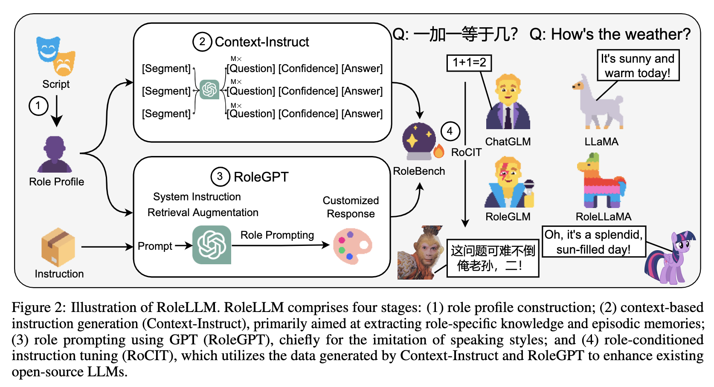

## Role play

### ROLELLM

https://arxiv.org/pdf/2310.00746.pdf

RoleLLM 针对角色扮演问题设计了一套解决方案，最终呈现了包括角色扮演指令微调数据集构造方案，模型，数据集与评估等，本文将对该工作进行介绍。

大型语言模型 (LLM) 的出现为角色扮演等复杂任务铺平了道路，角色扮演通过使模型能够模仿各种角色来增强用户交互。 然而，最先进的LLM的闭源性质及其通用训练限制了角色扮演的优化。 在该文章引入了 RoleLLM，这是一个用于基准测试、引导和增强LLM角色扮演能力的框架。 RoleLLM分为四个阶段：（1）100个角色的角色画像构建（包括95个英文角色和5个中文角色）； （2）基于上下文的指令生成（Context-Instruct），用于角色特定的知识提取，借助GPT从角色画像中抽取角色特定的知识以生成高质量的问答对； (3)RoleGPT：通过基于对话工程的角色提示语以及系统指令和检索增强，利用GPT(RoleGPT)的角色提示进行说话风格模仿； (4) 角色条件指令调优 (RoCIT)，用于微调开源模型以及角色定制。 通过 Context-Instruct 和 RoleGPT，创建了 RoleBench，这是第一个系统化、细粒度的角色扮演基准数据集，拥有 168,093 个样本。 此外，RoleBench 上的 RoCIT 生成了 RoleLLaMA（英文）和 RoleGLM（中文），显着增强了角色扮演能力，甚至达到了与 RoleGPT（使用 GPT-4）相当的结果。最后，在实验部分使用了三个基于Rouge-L的指标在不同的ground-truth下评估角色扮演模型三个不同维度的能力。

参考阅读

https://zhuanlan.zhihu.com/p/660580369